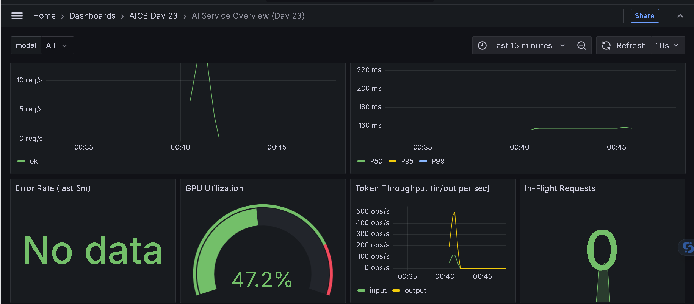
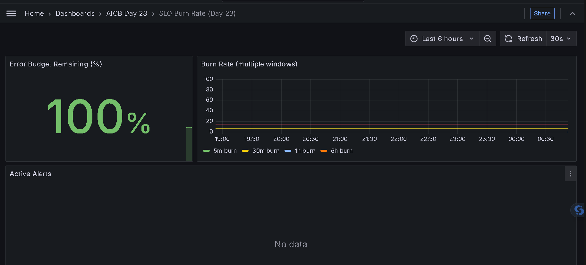
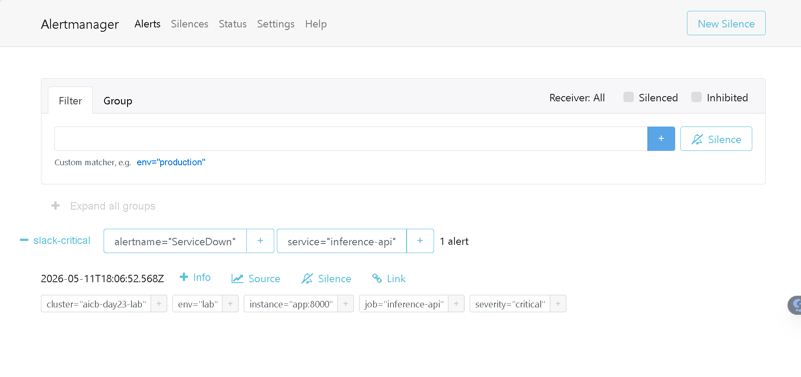
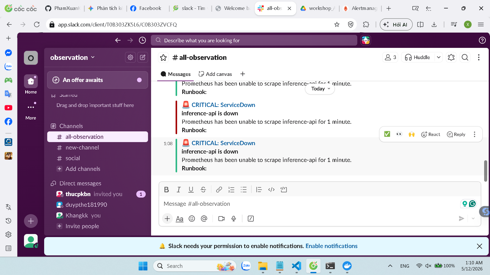
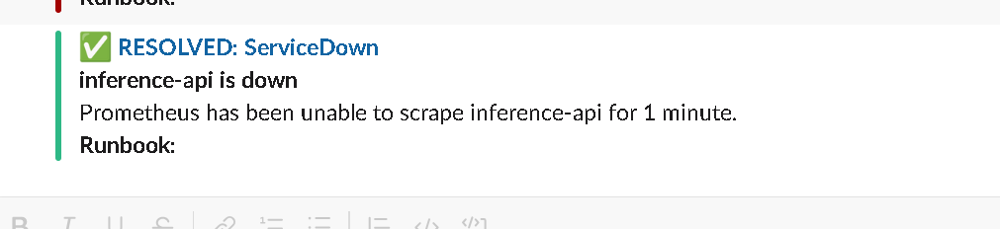
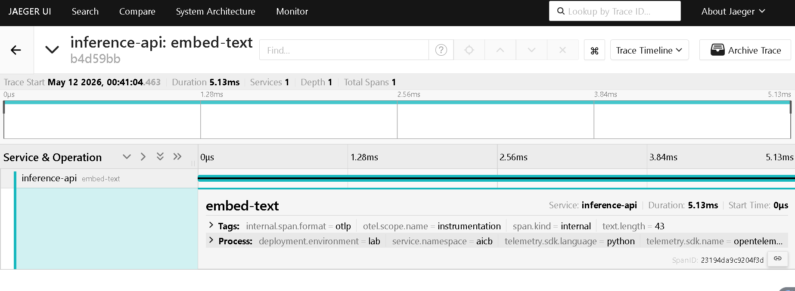

# Day 23 Lab Reflection

> Fill in each section. Grader reads the "What I'd change" paragraph closest.

**Student:** Phạm Xuân Khang
**Submission date:** 2026-05-12
**Lab repo URL:** https://github.com/PhamXuanKhang/Day23-Track2-Observability-Lab

---

## 1. Hardware + setup output

Output of `python3 00-setup/verify-docker.py` after pre-pulling the stack images:

```
Pre-pulling 6 images (the FastAPI app builds locally)...
  pulling: prom/prometheus:v2.55.0
  pulling: prom/alertmanager:v0.27.0
  pulling: grafana/grafana:11.3.0
  pulling: grafana/loki:3.3.0
  pulling: jaegertracing/all-in-one:1.62.0
  pulling: otel/opentelemetry-collector-contrib:0.114.0
All images cached.
Docker:        OK  (29.4.0)
Compose v2:    OK  (5.1.1)
RAM available: 3.76 GB (OK)
Ports free:    OK
Report written: /mnt/d/01_learning/ai_ml/AI20K_VINUNI/assignments/Day23-Track2-Observability-Lab/00-setup/setup-report.json
```

The lab ran close to the minimum hardware requirement: Docker reported 3.76 GB available RAM, which is just under 4 GB but still passed the setup gate and was enough for the 7-service Compose stack after the images were cached.

---

## 2. Track 02 — Dashboards & Alerts

### 6 essential panels (screenshot)



### Burn-rate panel



### Alert fire + resolve

| When | What | Evidence |
|---|---|---|
| T0 | killed `day23-app` with `make alert` | screenshot `alertmanager-firing.png` |
| T0+~80s | `ServiceDown` fired | screenshot `slack-firing.png` |
| T1 | restored app | — |
| T1+~60s | alert resolved | screenshot `slack-resolved.png` |





The load test was run with Locust 2.32.4 from Docker for 60 seconds, ramping to 10 users at 2 users/sec. The final observed load was approximately 687 successful `POST /predict` requests with 0 failures. Median latency was ~170 ms, average latency was ~178 ms, max latency was 482 ms, and throughput stabilized around 18-20 req/s.

### One thing surprised me about Prometheus / Grafana

The most surprising aspect was how multi-window multi-burn-rate alerting changes the mental model from "threshold exceeded" to "error budget is being consumed too quickly." Instead of alerting directly on a raw error rate, the SLO dashboard turns failures into burn rates over multiple windows. That made the dashboard more operational: a 0% error period correctly shows 100% error budget remaining and 0x burn rate, while the alert path still catches hard outages through `ServiceDown`.

I also found that dashboard usefulness depends heavily on PromQL handling missing series correctly. When there were no errors, the `status="error"` series did not exist at all, so the original burn-rate query returned "No data" rather than 0. Changing the recording rules to use `or vector(0)` and `clamp_min(...)` made the panel represent the real state of the system: no errors means zero burn, not missing telemetry.

---

## 3. Track 03 — Tracing & Logs

### One trace screenshot from Jaeger



The trace shows `predict` as the parent span with three child spans: `embed-text`, `vector-search`, and `generate-tokens`. Each child span carries useful AI inference attributes: prompt/text length on embedding, top-k on vector search, and token usage plus finish reason on generation.

### Log line correlated to trace

```
day23-app  | {"model": "llama3-mock", "input_tokens": 7, "output_tokens": 51, "quality": 0.817, "duration_seconds": 0.1552, "trace_id": "a5721b8baec50bc5199466d0d818eec5", "event": "prediction served", "level": "info", "timestamp": "2026-05-11T17:40:07.830739Z"}
```

The `trace_id` field in the structured JSON log is the correlation key between logs and traces. In a production setup, this is what lets an operator start from a suspicious log line, jump into the trace, then determine whether the latency came from embedding, retrieval, or token generation.

### Tail-sampling math

The OTel Collector tail-sampling policy keeps:

1. **100% of error traces** (`status_code = ERROR`)
2. **100% of slow traces** (latency > 2s)
3. **1% of remaining healthy traces**

Using the Locust run as a rough traffic estimate, the service reached about **18-20 requests/sec** with 0 observed request failures. For a typical production mix of 1% errors, 1% slow traces, and 98% healthy traces, the retained fraction would be:

```
sampled = N x (P(error) x 1.0 + P(slow and not error) x 1.0 + P(healthy) x 0.01)

For N = 20 traces/sec:
sampled = 20 x (0.01 + 0.01 + 0.98 x 0.01)
        = 20 x 0.0298
        = 0.596 traces/sec retained
        ~= 3% overall retention
```

That gives about **97% trace-volume reduction** while preserving all traces that are most useful for incident response: errors and slow outliers. In this lab run specifically, since the load test had 0 failures and latencies under 2 seconds, almost all retained traces would come from the 1% healthy-trace sampling rule.

---

## 4. Track 04 — Drift Detection

### PSI scores

```json
{
  "prompt_length": {
    "psi": 3.461,
    "kl": 1.7982,
    "ks_stat": 0.702,
    "ks_pvalue": 0.0,
    "drift": "yes"
  },
  "embedding_norm": {
    "psi": 0.0187,
    "kl": 0.0324,
    "ks_stat": 0.052,
    "ks_pvalue": 0.133853,
    "drift": "no"
  },
  "response_length": {
    "psi": 0.0162,
    "kl": 0.0178,
    "ks_stat": 0.056,
    "ks_pvalue": 0.086899,
    "drift": "no"
  },
  "response_quality": {
    "psi": 8.8486,
    "kl": 13.5011,
    "ks_stat": 0.941,
    "ks_pvalue": 0.0,
    "drift": "yes"
  }
}
```

The drift detector found two significant shifts. `prompt_length` had PSI=3.461 and KS=0.702, which indicates a major shift in the input prompt distribution. `response_quality` had PSI=8.8486 and KS=0.941, which is an even stronger shift and matches the synthetic change from high-quality to lower-quality responses. `embedding_norm` and `response_length` stayed stable, with PSI values below 0.02.

### Which test fits which feature?

| Feature | Recommended Test | Why |
|---|---|---|
| `prompt_length` | **KS (Kolmogorov-Smirnov)** | It is a continuous numeric feature, and KS is good at detecting changes in distribution shape, not just changes in the mean. The observed KS=0.702 confirms a large input-distribution shift. |
| `embedding_norm` | **PSI (Population Stability Index)** | Embedding norm is a continuous monitoring feature where interpretability matters. PSI gives simple production thresholds: under 0.1 is stable, 0.1-0.2 is moderate drift, over 0.2 is significant drift. This run had PSI=0.0187, so it stayed stable. |
| `response_length` | **KL divergence** | Response length is output-distribution behavior, and KL is useful when we care how different the current distribution is from the reference distribution in information-theoretic terms. The low KL=0.0178 shows the response-length distribution was stable. |
| `response_quality` | **KS + PSI** | Quality is a bounded [0,1] score. KS gives a strong non-parametric test for whether the current score distribution differs from the reference, while PSI gives an operational stability threshold. Both strongly agreed in this run: PSI=8.8486 and KS=0.941. |

**Where MMD fits:** Maximum Mean Discrepancy is best for multivariate or high-dimensional drift, such as comparing full embedding vectors. For this lab's scalar features, PSI/KL/KS are simpler and easier to explain. If I were monitoring the raw embedding vectors instead of `embedding_norm`, MMD would be more appropriate.

---

## 5. Track 05 — Cross-Day Integration

### Which prior-day metric was hardest to expose? Why?

The hardest prior-day metric to expose was Day 20 llama.cpp serving. Qdrant-style vector store metrics from Day 19 are relatively clean because collection count and search count are orthogonal to the Day 23 inference API. By contrast, llama.cpp metrics overlap conceptually with this lab's inference metrics: both systems expose token throughput, queue behavior, and completion counts. That creates more risk of confusing names, duplicated concepts, and label-cardinality problems.

For the lab I used the provided stubs and exposed Day 19 on port 9101 and Day 20 on port 9102. Prometheus scraped `day19_qdrant_collections` and `day20_llamacpp_tokens_per_second`, and the cross-day dashboard rendered all six panels. The prior-day panels for services not running were allowed to show "No Data," while Day 19/20 demonstrated that at least one real or stub prior-day source can be connected.

---

## 6. The single change that mattered most

> **Grader reads this closest.** What one thing about your stack design — a metric you added, a label you dropped, a panel you reorganized, an alert threshold you tuned — made the biggest difference between "works" and "useful"? Write 1-2 paragraphs. Connect it to a concept from the deck.

The single change that mattered most was making the observability outputs handle "zero" correctly instead of showing "No data." The SLO burn-rate dashboard initially looked broken during a healthy load test because there was no `status="error"` time series yet. In Prometheus, a missing series is not the same as a zero-valued series: `sum(rate(inference_requests_total{status="error"}[5m]))` returned an empty vector, so the burn-rate panels disappeared even though the real system state was good. Changing the recording rules to use `(sum(rate(...{status="error"}[window])) or vector(0)) / clamp_min(sum(rate(...[window])), 1e-9)` made the dashboard show 0x burn rate and 100% error budget remaining when there are no errors.

That change moved the stack from "technically instrumented" to operationally useful. A dashboard that says "No data" during a healthy period forces the operator to debug the dashboard instead of the service. A dashboard that says "0 burn" teaches the correct mental model: telemetry is present, the service is healthy, and the error budget is not being consumed. This connects directly to the observability principle that signals must be actionable. Metrics are not useful just because they exist; they are useful when their absence, zero value, and abnormal value each mean something unambiguous. Fixing that distinction made the SLO panel reliable enough to use during both normal load and incident demos.
